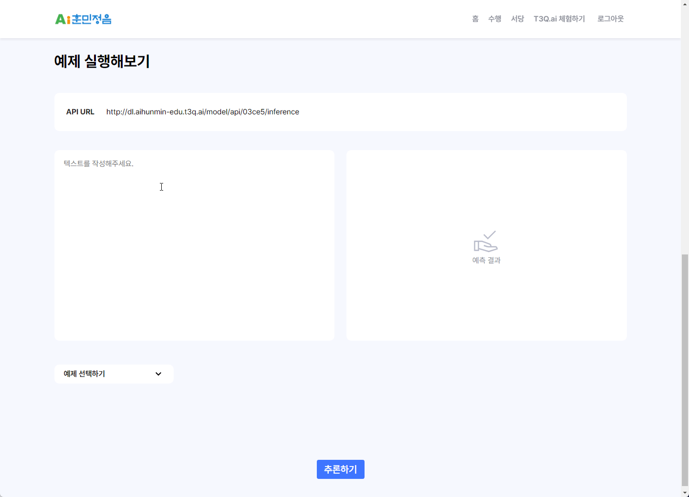
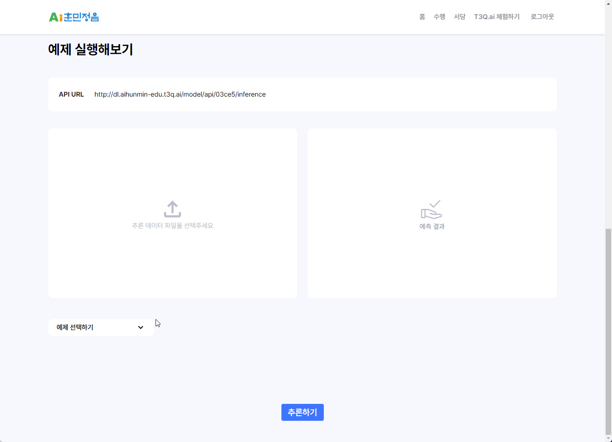
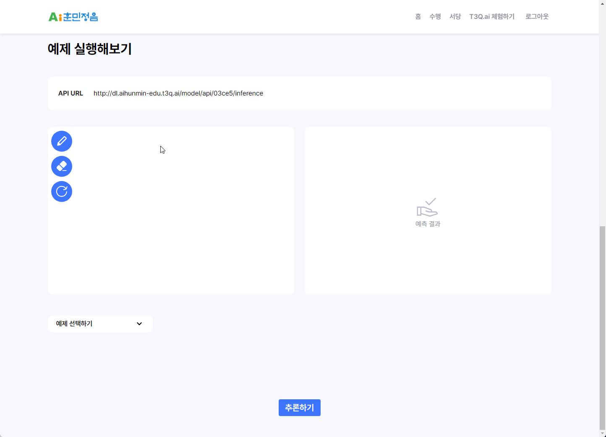

<h1>👨‍🏫 티쓰리큐 AI 훈민정음 리뉴얼 프로젝트</h1>
티쓰리큐 AI 훈민정음 리뉴얼 프로젝트의 프론트엔드 레포지토리입니다.

개인 포트폴리오 목적으로 작성된 README이며, 프로젝트에 대한 자세한 사항은 추후 업데이트 예정입니다.

## 🎯프로젝트 소개

- **프로젝트 목적** : 티쓰리큐 교육시스템은 인공지능에서 다루는 데이터 7종, 인공지능이 하는 태스크 4가지를 조합한 28가지 우수케이스를 통합 플랫폼에 탑재한 사례집으로 AI훈민정음이라 불린다.

  교육시스템 프로젝트는 기존 순수 html로 빌딩된 스태틱 웹사이트인 구(舊) 교육시스템을 리디자인하여 사용자에게 보다 나은 UI/UX를 제공하고, 리액트를 사용한 리빌딩 과정을 통해 이전보다 편리한 유지보수와 쉬워진 확장가능성을 제공하는 게 목표였다.

- **프로젝트 인원**: FE 4인 / BE 2인
- **프로젝트 기간**: 2023.07.10 ~ 2023.09.15
- **주요 기능** :

  1. 스태틱 html 페이지에서 리액트 동적 페이지 라우팅으로 변경
  2. keyclock을 사용한 로그인 기능
  3. 예제 북마크 기능
  4. 서버에서 받아온 예제 데이터를 목록화 하고, 선택 시 화면에 해당 파일을 렌더링하는 기능
  5. 예제 데이터를 입력하고 추론 버튼을 누르면 티쓰리큐 ai 시스템에서 추론된 결과물을 확인할 수 있는 기능.

 

## 🛠 기술스택

| 도구/언어    | 설명                                                         |
| ------------ | ------------------------------------------------------------ |
| Vite         | 프론트엔드 빌드 도구로, 빠른 핫 모듈 교체와 개발 환경을 제공 |
| React        | UI를 구성하기 위한 JavaScript 라이브러리                     |
| TypeScript   | 자바스크립트에 정적 타이핑 기능을 추가한 언어                |
| Recoil       | React의 상태 관리 라이브러리                                 |
| React Router | React 애플리케이션의 라우팅을 담당하는 라이브러리            |
| Module CSS   | CSS를 모듈화하여 컴포넌트 별로 스타일링을 할 수 있게 함      |

 

## 🎨 디자인(Design)

[피그마 시안 주소로 이동](https://www.figma.com/file/rYcgfjSHVvziklhwcoBh4J/%ED%8B%B0%EC%93%B0%EB%A6%AC%ED%81%90_%EA%B5%90%EC%9C%A1%EC%8B%9C%EC%8A%A4%ED%85%9C?type=design&node-id=0%3A1&mode=design&t=bS0vX7XJCZA7DaXp-1)

 

## 📄 문서(Documentation)

[인수인계를 위한 노션 문서로 이동](https://therapeutic-princess-27b.notion.site/c9e2da0995aa40a9b91335a2cee37210?pvs=4)

## 🚀 서비스 주소

[티쓰리큐 ai 훈민정음](http://aihunmin-edu.t3q.ai)

 

<!-- ## 🙋‍♂️ 발표자료(Presentation)
[발표 자료 주소로 이동](https://docs.google.com/presentation/d/1Vbh-usncKwjxSjYeJQQNWtvAZBR94airOfvn2xKiAbA/edit#slide=id.p) -->

## 🎬 담당 기능

| 텍스트 추론                      |
| -------------------------------- |
|  |

| 이미지 추론                     |
| ------------------------------- |
|  |

| 그림판 기능                  |
| ---------------------------- |
|  |

1. 웹 접근성 검토 및 마크업 수정
2. 서버에서 받아온 예제 데이터를 목록화
3. 예제 데이터의 양식은 모두 똑같은 형식으로 고정되어있으나 렌더링 되어야 하는 데이터의 모습은 케이스 별로 크게 다른 경우 였기에 서버에서 받아온 예제 데이터를 클라이언트단에서 **모든 케이스에 대응**하도록 조건부 가공 후 화면에 렌더링
4. 클라이언트에서 작성한 데이터를 서버로 데이터 요청 보낼 수 있도록 데이터 가공
5. 캔버스를 사용한 그림 그리기 기능 구현
6. 음성 녹음 기능 구현
7. 예제 선택시 잦은 비디오 변환 요청을 방지하기 위해 캐싱 기능 구현
8. 서버에서 받아온 추론 결과 데이터를 클라이언트단에서 조건부 가공 후 화면 렌더링
